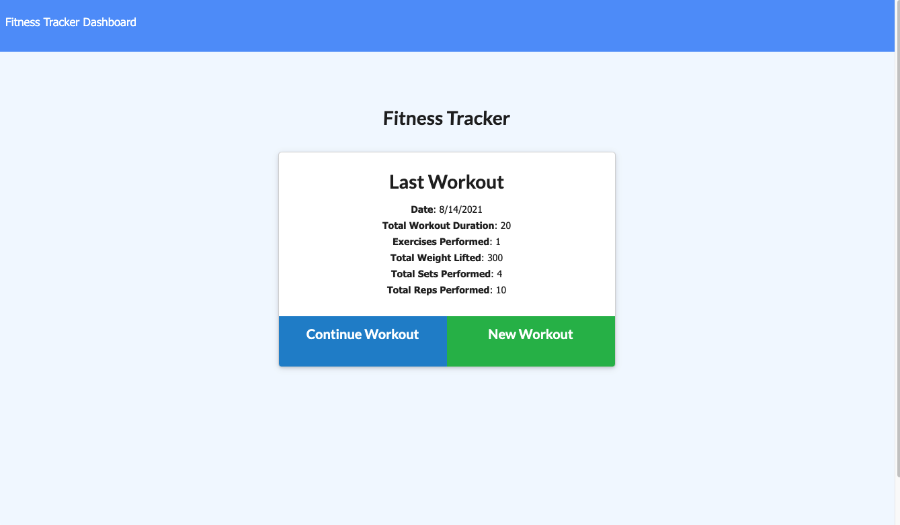
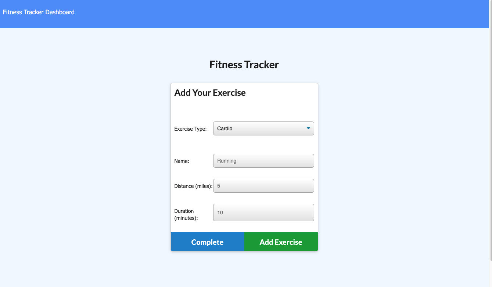
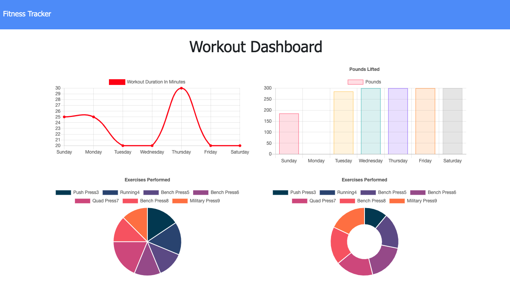

# **Workout-Tracker**

  

  ## Description

  Add exercises to the most recent workout plan.

  Add new exercises to a new workout plan.

  View the combined weight of multiple exercises from the past seven workouts on the stats page.

  View the total duration of each workout from the past seven workouts on the stats page.

  ## Table of Contents
  * [Description](#description)
  * [Installation](#installation-instructions)
  * [Usage](#usage)
  * [License](#license)
  * [Contributions](#contributions-guidelines)
  * [Tests](#test-instructions)
  * [Questions](#questions)

  ## Installation Instructions
  1.Clone the repository

    git clone  git@github.com:eycs0317/Workout-Tracker.git

  2.Install all the dependencies

    npm i

  3.Seed the sample data

    npm run seed

  4.Run the server

    npm run watch
    go to Your browser http://localhost:3000/

  ## Deployed Link

  [Heroku Link](https://protected-brushlands-01106.herokuapp.com/)

  ## License
  [MIT License](https://opensource.org/licenses/MIT)

  ## Questions
  If you have any questions: eycs0317@gmail.com

  [My GitHub](https://github.com/eycs0317)

  ## Sample Image

  
  
  

